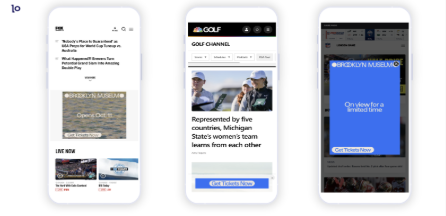
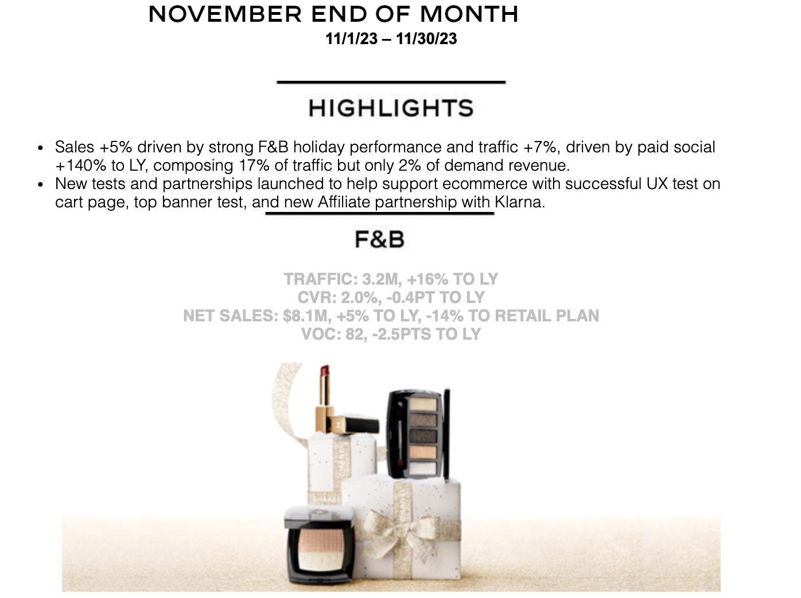
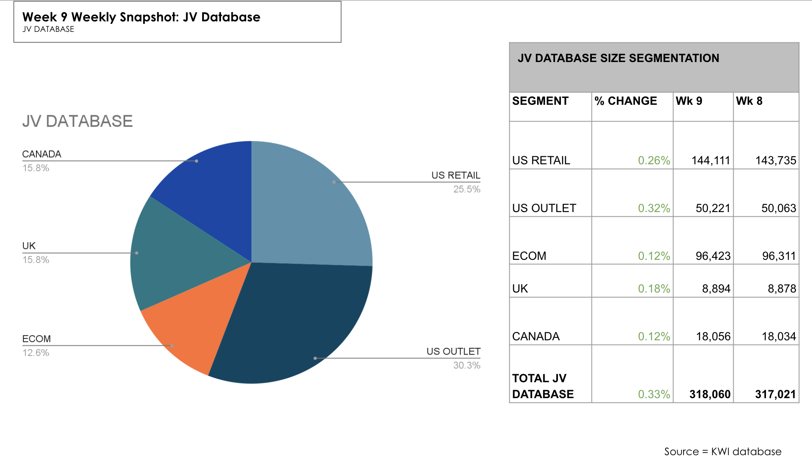

# Najaah Cooper

**Senior Marketing Manager | Brand, Paid Media & Growth**

I’m a Senior Marketing Manager with experience leading brand, paid media, CRM, and growth initiatives across luxury, culture, and entertainment brands. My work sits at the intersection of **storytelling, data, and performance**, translating insight into execution that drives awareness, engagement, and revenue.

I partner cross-functionally with brand, creative, growth, and leadership teams to deliver integrated marketing strategies with measurable business impact.

---

## Selected Case Studies

---

## Brooklyn Museum  
**Paid Media Optimization & Campaign Delivery**

**Objective**  
Drive awareness and ticket conversions for major exhibitions through cross-channel paid media while ensuring accurate delivery, pacing, and tracking integrity.

**Strategy & Execution**
- Managed multi-platform media buys across **Meta, Google, Condé Nast, The Trade Desk, ArtNews, and NYTimes**
- Geo-targeted audiences near cultural institutions and high-intent points of interest
- Led real-time pacing, trafficking QA, and delivery oversight to prevent underdelivery and maximize budget efficiency

**Key Results**
- ~**2.5M+ impressions** across paid channels  
- **98% delivery accuracy** across platforms  
- **+15% increase in ticket conversions**

---

## Chanel  
**Luxury E-Commerce, Email & Paid Performance**

**Scope**
Oversaw digital performance reporting and optimization across **Fashion, Beauty, Eyewear, and Fine Jewelry**, partnering closely with paid media, CRM, and site merchandising teams.

**Key Contributions**
- Supported major launches including **Cruise Collection, Holiday, and Eyewear campaigns**
- Analyzed traffic, conversion, and revenue trends across paid social, email, and site experiences
- Identified optimization opportunities across UX, creative, and targeting

**Selected Metrics**
- **$8.1M net sales** in monthly reporting period  
- **+15% YoY traffic growth** driven by paid media  
- Email personalization initiatives drove **+$116K incremental revenue**
- Affiliate partnership launch (Klarna) generated **$51K in first month**

---

## John Varvatos  
**CRM, Email Strategy & Revenue Optimization**

**Role**
Led CRM reporting, email performance analysis, and campaign optimization across retail, outlet, and e-commerce audiences.

**Key Initiatives**
- Managed weekly email cadence and performance reporting
- Optimized segmentation and creative strategy based on device behavior and conversion trends
- Supported promotional and seasonal campaigns driving direct revenue impact

**Results**
- **$55.5K revenue** generated across 9-email campaign series  
- **38% top open rate** on promotional sends  
- Strong mobile-driven revenue performance with AOV insights influencing future strategy

---

## Marvel  
**CRM & App Engagement Strategy**

**Role & Scope**
As CRM Manager, owned weekly content strategy for **Marvel Pulse** and **Marvel Unlimited** newsletters, while partnering with promotional and affiliate teams (LEGO, Walmart, Hasbro).

**Engagement Strategy**
- Introduced content-driven engagement loops tied to in-app behavior
- Leveraged weekly cadence, editorial storytelling, and promotional alignment
- Collaborated cross-functionally to align CRM messaging with product and app features

**Impact**
- **+30% week-over-week increase in Marvel Unlimited app engagement**
- Improved click-through and session depth among monthly subscribers
- Strengthened alignment between CRM, product, and promotional teams

---

## Core Expertise

- Brand & Integrated Marketing Strategy  
- Paid Media & Performance Optimization  
- CRM, Email & Lifecycle Marketing  
- Content Strategy & Storytelling  
- KPI Reporting & Executive Dashboards  
- Cross-Functional Leadership  

---

📩 **Contact:**  
LinkedIn: linkedin.com/in/nhcooper  
Portfolio:https://docs.google.com/presentation/d/1JbwxEX_7EwiR62ug-QR7YGtUVYYXVsdIMDliUFNwWyQ/edit?usp=sharing
